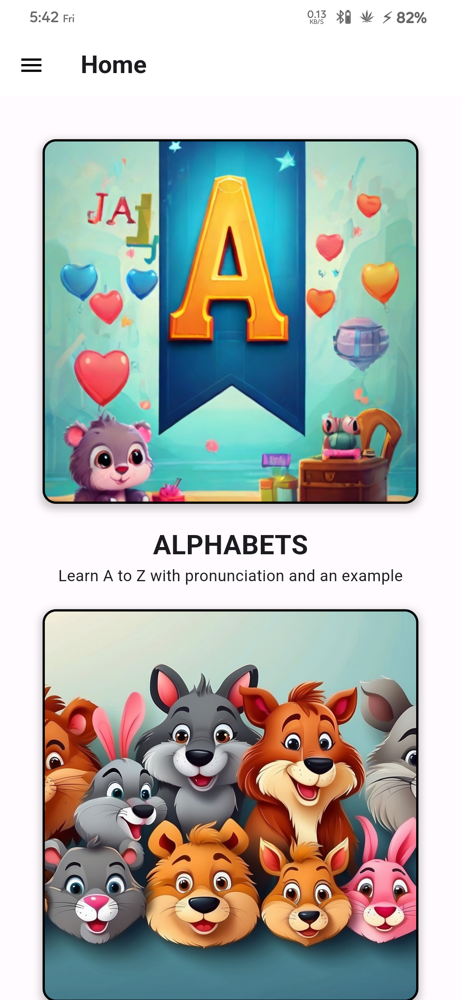
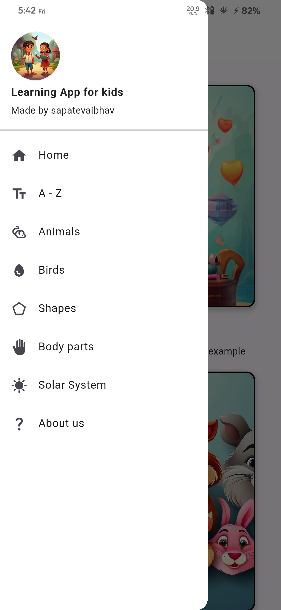
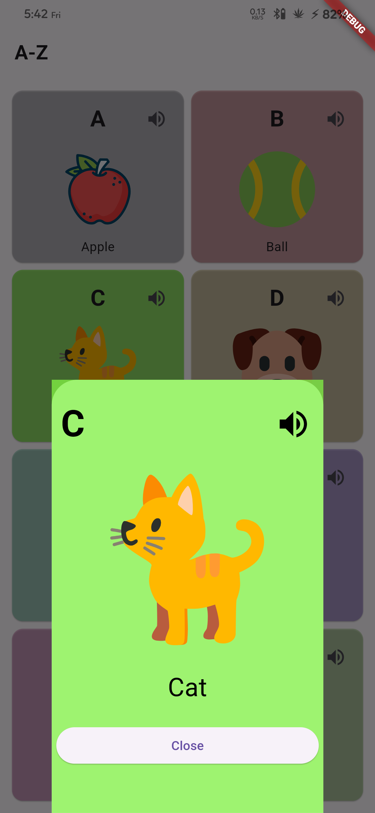
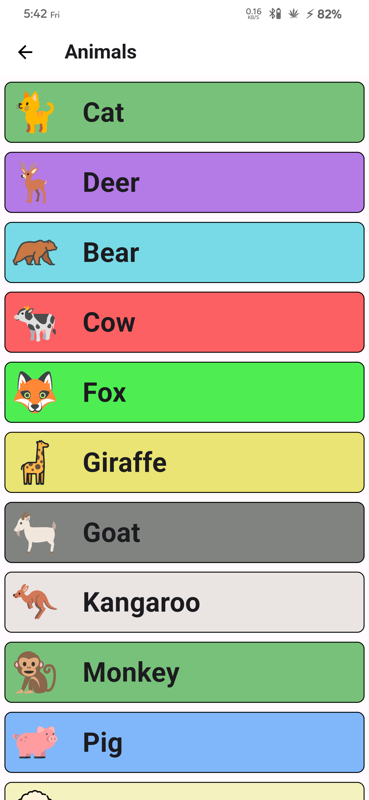
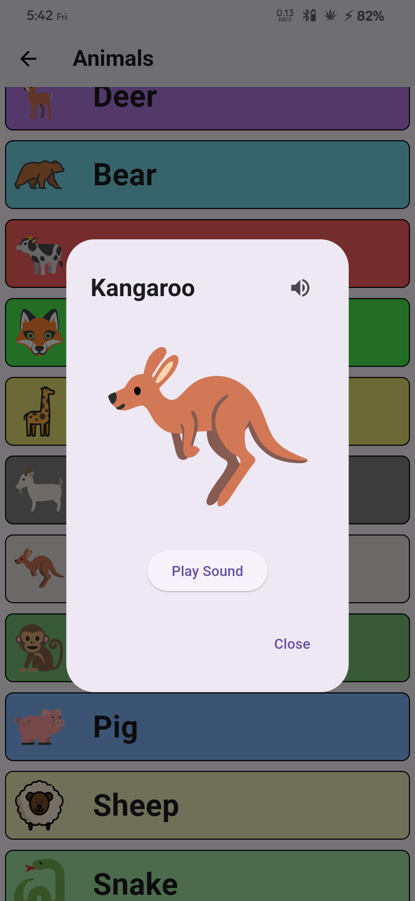

# Learn


<br>
<div align="center">

 &nbsp; 
[](https://flutter.dev/) &nbsp; 
 &nbsp; 
&nbsp; 
 &nbsp;
<a href="https://github.com/VaibhavCodeClub/learn"></a>
&nbsp;
<a href="https://github.com/VaibhavCodeClub/learn/stargazers"></a>
&nbsp;<a href="https://github.com/VaibhavCodeClub/learn/network/members"></a>
&nbsp; <br>

&nbsp;

&nbsp;

&nbsp;  
<a href="https://github.com/VaibhavCodeClub/learn/blob/main/LICENSE"></a>
&nbsp;
<a href="https://github.com/VaibhavCodeClub/learn/issues"></a>
&nbsp;
<a href="https://github.com/VaibhavCodeClub/learn/issues?q=is%3Aissue+is%3Aclosed"></a>
&nbsp;
<a href="https://github.com/VaibhavCodeClub/learn/pulls"></a>
&nbsp;
<a href="https://github.com/VaibhavCodeClub/learn/pulls?q=is%3Apr+is%3Aclosed"></a>
&nbsp;

<br>

<a href="https://android.izzysoft.de/repo/apk/vdrs.sappu.lafk.learn">  </a> 
<a href="https://github.com/VaibhavCodeClub/learn/releases">  </a> <br>
</div>
Welcome to **Learn**, a simple learning app built using Flutter for kids. This app is designed to provide an engaging learning experience for children, covering a wide range of topics including :

- A-Z Alphabets with examples and pronunciation.
- Animals and their pronunciation along with their voices.
- Body parts and their pronunciation with Short information on various topics.

More exciting features are planned for future updates, such as birds and their voices, information on the solar system, knowledge of shapes, and much more!

### Getting Started

To get started with the **Learn** app, follow these simple steps :

### Clone the Git Repository

```bash
git clone https://github.com/VaibhavCodeClub/learn
```
### Run the Flutter Project

Please ensure you have Flutter installed. If not, you can follow the instructions on [Flutter.dev](https://flutter.dev/) to get it installed on your machine.

Navigate to the project directory using the terminal.

Run the following command to fetch the dependencies:
```bash 
flutter pub get
```
Once the dependencies are fetched, run the app on your preferred device using :
```bash
flutter run
```
That's it! The app should now be running on your device/emulator.

### Screenshots

    


**Note:** If you encounter any issues or have suggestions for improvement, please feel free to [create an issue](https://github.com/VaibhavCodeClub/learn/issues/new/choose) on our GitHub repository. We appreciate your feedback!

Made with ❤️ by [sapatevaibhav](https://github.com/sapatevaibhav).

Don't forget to star ⭐ the repository if you find it useful!
<!-- Hits since 10 May 2024 00:20 IST -->

